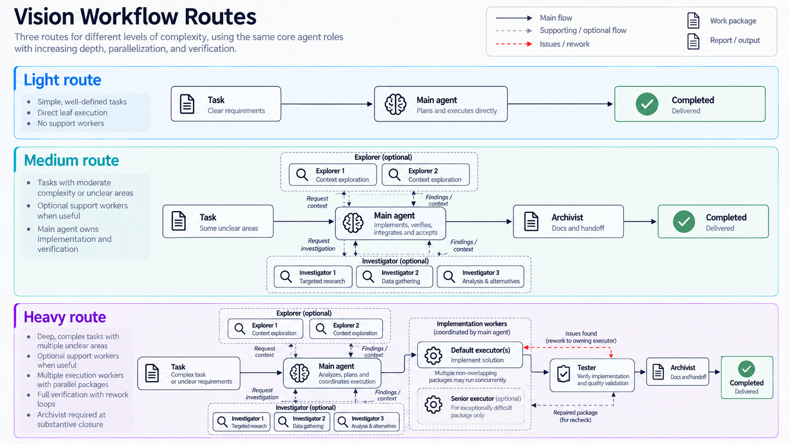
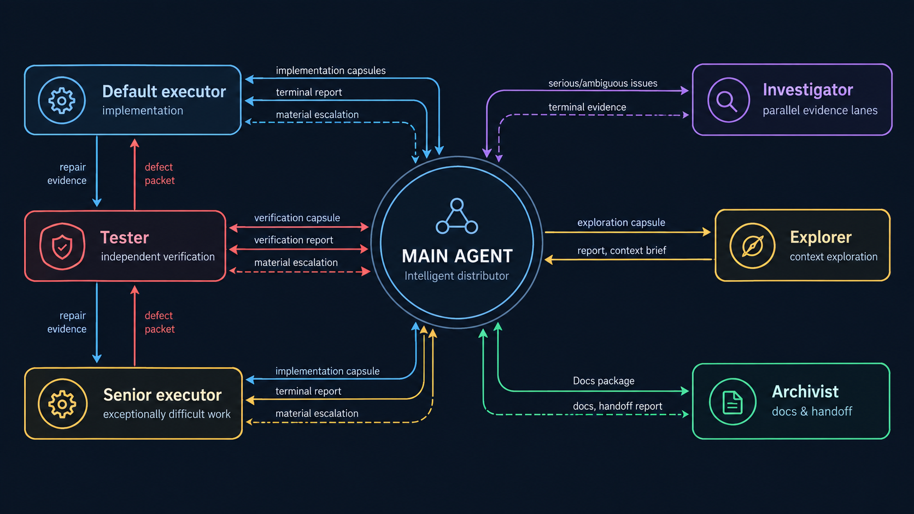
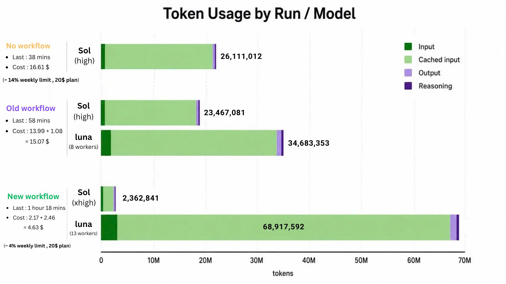

# Vision
<h3 align="center"><big><big><strong>SIMPLE&emsp;&emsp;───&emsp;&emsp;EASY&emsp;&emsp;───&emsp;&emsp;EFFICIENT</strong></big></big></h3>
<p align="center"><small>&nbsp;&nbsp;&nbsp;&nbsp;&nbsp;&nbsp;&nbsp;(to use)&nbsp;&nbsp;&nbsp;&nbsp;&nbsp;&nbsp;&nbsp;&nbsp;&nbsp;&nbsp;&nbsp;&nbsp;&nbsp;&nbsp;&nbsp;&nbsp;&nbsp;&nbsp;&nbsp;&nbsp;&nbsp;&nbsp;&nbsp;&nbsp;&nbsp;&nbsp;&nbsp;&nbsp;(to install)&nbsp;&nbsp;&nbsp;&nbsp;&nbsp;&nbsp;&nbsp;&nbsp;&nbsp;&nbsp;&nbsp;&nbsp;&nbsp;&nbsp;&nbsp;&nbsp;&nbsp;&nbsp;&nbsp;&nbsp;&nbsp;(token consumption)</small></p>
<hr>



Built for token-efficient agent orchestration, with swarm execution, persistent context support, and compact knowledge handoffs between agents. `agent_docs/` provides durable project memory for goals, architecture, decisions, progress, and session handoffs.

Vision is **one workflow with two native runtime backends**: the Codex CLI/app and
OpenCode. Installation, updates, configuration, removal, and token reporting
support either client or both, and shared workflow logic is never duplicated.

> ⭐ For lightweight tasks, it won’t overdo things. Light route is default.

## 1. Quick installation ⚙️
### Open Codex CLI / Codex app from your project directory

Change permision to `approve for me` or `full access`.
▶️ Send:
```text
Download and extract the latest `vision-<version>.zip` asset from https://github.com/IyedBecheikh/vision/releases. Verify it against `SHA256SUMS`, then read the bundled `vision/operate/bootstrap.md` and follow it to complete the initial installation.
```
> ⭐ Recommended: use 5.6 Luna xhigh for installation. 

🔄 Restart Codex after installation

The initial bootstrap will include creating the project documentation framework `agent_docs/` using `archivist` subagent. Once that bootstrap is complete, the current project is ready to use. Whenever you need to install this workflow for a new project, simply open Codex and send: `vision --install`

> Requires Python 3.11 or newer for deterministic lifecycle operations.

### OpenCode

OpenCode loads the same workflow from its native user configuration
(`~/.config/opencode/`). Install it explicitly, or both clients at once:

```text
vision --install --platform codex
vision --install --platform opencode
vision --install --platform both
```

When `--platform` is omitted and multiple supported clients are detected, Vision
asks which to use. OpenCode owns provider authentication, credentials, and the
main-session model; Vision installs only the shared instructions, the six native
Markdown subagents (`explorer`, `investigator`, `default_executor`,
`senior_executor`, `tester`, `archivist`), and the `deployment-token-report`
skill. Restart OpenCode after installation.

**Note:** If you cannot upgrade directly to a newer version. Run `vision --remove` to uninstall it first, then install the newer version.

## 2. Workflow usage 

### This workflow has 3 routes:
- Light route : No subagents, no workflow, minimal context.
- Heavy route: Delegate bounded production and verification to Executors and Testers, with Explorer for context, Investigator for solution research, and Archivist for documentation. The main agent owns orchestration, synthesis, and decisions.
- Medium route: Use Explorer, Investigator, and Archivist for read-only discovery, solution research, and documentation while the main agent handles implementation and verification. Choose this route when you want workflow-mode context support without delegating production work, like front-end design, visualization, or 3D works, but it will burn tokens faster than Heavy route.

### How to use
- Normally, for simple work, general Q&A, you don't need to do anything. `light route` is the default route.

--------------------------------
- When starting a new task, tell Codex :
```text
use medium/heavy route. [your task description]
```
Or continue a task that was already underway in the previous session: 
```text
use medium/heavy route. Continue ongoing work.
```
> Codex stays on the selected route until you change it

---------------
> **⭐ Recommendation:** Assign very large and complex tasks to the `heavy route` to make the most of its capabilities and maximize token usage savings. Don't hesitate to choose Sol xhigh / Astra high for this route. Using much lower reasoning efforts will not actually save tokens and will severely reduce its coordination capabilities.

### Native commands

Vision installs first-class entry points in each client. They activate the same
shared workflow as natural language; they are not separate route implementations
and the deterministic CLI still does every mutation.

| Vision action | Codex skill | OpenCode command |
| --- | --- | --- |
| Light | `$vision-light` | `/light` |
| Medium | `$vision-medium` | `/medium` |
| Heavy | `$vision-heavy` | `/heavy` |
| Install | `$vision-install` | `/install` |
| Update | `$vision-update` | `/update` |
| Configure | `$vision-config` | `/config` |
| Remove | `$vision-remove` | `/remove` |

```text
$vision-heavy Implement authentication      # Codex
/heavy Implement authentication             # OpenCode
/config senior openai/gpt-6-sol#medium      # OpenCode
```

All of `use heavy route. Fix X`, `$vision-heavy Fix X`, and `/heavy Fix X` enter
the same Heavy route with the same route contract. The natural-language form
remains fully supported.

### Models and all-Luna mode

The orchestrator (main agent) and the Senior Executor default to Sol. On Codex,
switch either with `vision --config`: use `orch` for the orchestrator (top-level
`model` in `~/.codex/config.toml`) and `senior` for the Senior Executor
(`~/.codex/agents/senior_executor.toml`). Each accepts `sol` or `luna`; the other
workers are already Luna. Set both to `luna` to run an all-Luna workflow.
Switching a model preserves that role's reasoning effort.

On OpenCode, configure any worker role with a native model id
(`provider/model` or `provider/model#variant`); Vision stores the mapping and
regenerates that role's agent file, so generated `agents/*.md` files are never
edited by hand:

```text
vision --config explorer anthropic/claude-sonnet-4-5#high
vision --config senior_executor openai/gpt-5.1-codex#high
```

Pass `--platform opencode` when both clients are installed. The OpenCode
main/orchestrator model stays under OpenCode's own control.

In Heavy, workers return compact evidence-linked reports directly to the main
agent through the platform's native parent-child result channel (Codex threads
or OpenCode child/subagent sessions). The main batches related workers and makes
one decision after the relevant reports arrive.


*Heavy route*

What's special about the system:

- Built-in project memory: `agent_docs/` keeps project goals, architecture, progress, decisions, and the latest handoff across sessions.
- Flexibility: The system doesn't force the main agent into a rigid process: requiring coordination in this way, that way... It provides it with resources and power (specialized agents) and fine-tuning and guidance based on hundreds of trials.
- Fine-tuned balance: Main agent's control <---> costs & task completion capabilities. based on analysis and observation, not on feeling. 
- Knowledge distribution: Each task package from the main agent to the workers includes a task completion guide.
- Batching guidelines prevent excessive main agent rollout.
- Two parallel Explorers map each bounded context task from complementary angles;
  three parallel Investigators research each bounded fault or solution problem
  from independent angles.
- Workflow policy lives in the managed user-level `AGENTS.md` region
  (`~/.codex/AGENTS.md` or `~/.config/opencode/AGENTS.md`);
  each project `AGENTS.md` remains native, project-owned personalization.
- Worker reports preserve material evidence while referencing bulky logs and artifacts instead of copying them.
- The **Senior Executor** serves as a fallback for exceptionally difficult problems where stronger reasoning is required.
- Addresses the issue of the main agent waking up workers too often.
- Built-in token report: End-of-session token statistics for each agent, with a
  Codex backend and a separate OpenCode backend selected through one shared
  entry point, allowing you to monitor how much each agent rolls out and how
  they use their tokens.
......

## Light benchmark
**Batching guidelines** techniques(since 1.1.3 version) significantly reduce the main agent's rollout, which in turn reduces the main agent's cached input tokens, a major component of the operation cost, see **New workflow** below :



The current benchmark is an initial case study. See the
[benchmark coverage proposal](benchmarks/README.md) for ideas on testing more
tasks and AI providers.

## 3. More details 

Send these exact commands to Codex (or OpenCode) from the relevant project directory:

| Command | Purpose |
| --- | --- |
| `vision --install` | Install workflow in the current project and initialize its documentation framework. Add `--platform codex\|opencode\|both` to select clients. |
| `vision --check-update` | Check for a newer release without installing it. |
| `vision --config orch sol\|luna` | Switch the Codex orchestrator (main-agent) model; use `luna` for an all-Luna workflow. |
| `vision --config senior sol\|luna` | Switch the Codex Senior Executor model; use `luna` (with `orch luna`) for an all-Luna workflow. |
| `vision --config <role> <model-id>` | On OpenCode, map a worker role (`explorer`, `investigator`, `default_executor`, `senior_executor`, `tester`, `archivist`) to a native `provider/model#variant`. |
| `vision --update` | Install a newer release for the user and current project, or bring the current project up to an already installed release. |
| `vision --remove` | Remove the installed workflow after a destructive dry-run and confirmation. Add `--platform codex\|opencode\|both` to select clients. |

For the complete architecture, route, lifecycle, ownership, safety, and release
analysis, see [workflow_breakdown.md](workflow_breakdown.md).

## 4. Acknowledgements

Vision is a rebranded fork of the
[viettran-edgeAI/codex_workflow](https://github.com/viettran-edgeAI/codex_workflow)
project. Credit for the original workflow architecture, routes, worker roles,
`deployment-token-report` skill, benchmarks, and release tooling belongs to its
original author and contributors.
