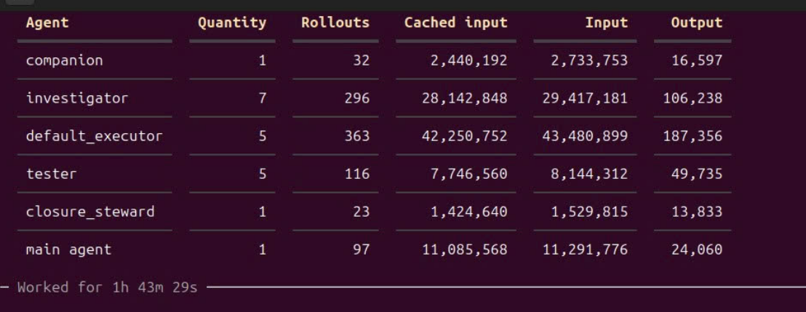

# vision — Architecture and Operational Analysis

This document is a focused analysis of the design lessons behind
`vision`, followed by its agent roles, installed topology, lifecycle
commands, deployment token reporting, and release boundaries. It analyzes the source
package represented by `vision/`; it is not an additional executable
instruction surface.

For exact behavior, use the source that owns the relevant contract:

- `vision/operate/user_AGENTS.md` for merged user-level workflow
  behavior, route selection, lifecycle dispatch, and first deployment-state
  entry;
- `vision/medium_route.md` and `vision/heavy_route.md` for
  route-specific orchestration;
- `vision/workers/*.md` for the canonical, platform-neutral worker instruction
  body of each role;
- `vision/agents/*.toml` for the Codex rendering of worker models, permissions,
  and role boundaries;
- `vision/archivist.md` for documentation assignments and deployment
  closure;
- `vision/operate/*.md` for user-facing lifecycle procedures;
- `vision/runtime/*.py` for deterministic lifecycle mutations;
- `vision/runtime/platforms/*.py` for the Codex and OpenCode runtime backends;
- `vision/runtime/commands.py` for the canonical native command mapping and
  renderers; and
- `vision/skills/deployment-token-report/` for deployment usage
  reporting (a shared entry point over `report_tokens_codex.py` and
  `report_tokens_opencode.py`).

This revision describes packaged version `1.0.0`, read from
`vision/operate/VERSION`. Version markers, package validation, and
release tests prevent that value from drifting from the distributed user
instruction block.

## Platform Backends

Vision is one workflow with two native runtime backends. A platform adapter owns
only the client-specific realization of the shared workflow:

```text
canonical worker instructions (vision/workers/<role>.md)
        |
 platform renderer
   /             \
Codex TOML      OpenCode Markdown
```

- **Codex** installs to `~/.codex/`: TOML workers in `~/.codex/agents/`, the
  managed region in `~/.codex/AGENTS.md`, workflow-owned keys in
  `~/.codex/config.toml`, the skill in `~/.codex/skills/`, and the runtime in
  `~/.codex/vision/`.
- **OpenCode** installs to `~/.config/opencode/`: native Markdown subagents in
  `~/.config/opencode/agents/`, the managed region in
  `~/.config/opencode/AGENTS.md`, the skill in
  `~/.config/opencode/skills/`, and the runtime in
  `~/.config/opencode/vision/`. OpenCode owns provider authentication,
  credentials, available models, and the main-session model; Vision only adds
  worker-role agent files. Read-only roles deny `edit` and `bash`; every worker
  denies `task` so workers cannot orchestrate each other.
- **Selection** is explicit and persisted: `--platform codex`, `--platform
  opencode`, or `--platform both`. Installs, updates, and removals operate only
  on the selected platform's Vision-owned resources, and unrelated client
  content is preserved. Interactive installs prompt when several clients are
  detected and no platform is given.
- **Worker models** for OpenCode use native `provider/model#variant` ids stored
  in Vision-owned configuration
  (`~/.config/opencode/vision/config.json`); changing a mapping regenerates the
  affected `agents/*.md` file so users never edit generated files by hand.
- **Native commands** come from one canonical mapping
  (`runtime/commands.py`). Each platform backend installs its own surface:
  Codex skills (`$vision-light`, `$vision-medium`, `$vision-heavy`,
  `$vision-install`, `$vision-update`, `$vision-config`, `$vision-remove`) and
  OpenCode slash commands (`/light`, `/medium`, `/heavy`, `/install`,
  `/update`, `/config`, `/remove`). Route commands activate the existing shared
  route; lifecycle commands call the deterministic runtime. Vision does not rely
  on legacy `~/.codex/prompts` custom slash commands.
- **Token reporting** uses one shared entry point with a separate backend per
  platform: `report_tokens_codex.py` reads Codex session JSONL, while
  `report_tokens_opencode.py` uses OpenCode's native session list and export
  interfaces. The final six-column report format is identical.


## 0. A Deep Dive into Codex Orchestration

We can't simply tell the main agent:

> "Hey Sol, make a plan for this task and delegate the implementation to Luna subagents."

There are several aspects that need to be balanced carefully.

### 1.Main-agent control vs. context savings and task completion

- How much of the codebase should the main agent load itself?
- Should it personally review the output of tests performed by testers?
- Should it inspect logs and reports to understand what the subagents are doing, or let them work independently and simply accept their final results?

### 2.Main-agent rollouts vs. worker rollouts

In Codex, every time a model stops to call a tool, coordinate a subagent, etc., it consumes another rollout.
And each rollout reloads the model's entire context, although most of that will usually be cached input tokens.
So every time the main agent calls or coordinates a worker, that also costs a main-agent rollout.

This means that overly fine-grained coordination with workers and repeatedly
requesting reports can become counterproductive from a token-cost perspective.

You may successfully move some work to a worker, but in exchange, the main agent has to reload its entire context.
In practice, you're basically trading **cached input tokens from the main agent** for **input/output tokens from workers**.
In Heavy, related workers are dispatched together and return compact reports
directly to the main. The main waits for the relevant batch and decides once.

This is why I apply **batching guidelines** to reduce the number of main-agent rollouts. I'll explain them later in the `vision` design section.
AI isn't going to naturally balance all of these trade-offs for you. You have to experiment, measure, observe, and optimize the workflow yourself.

That's also why I added end-of-session token statistics through the built-in workflow skill:



---

### Why Not Just Ask Codex to Design an Efficient Orchestration Framework?

Why not simply ask Codex to propose an orchestration architecture that is both efficient and actually feasible on the platform?
There are several problems.

#### 1. Perspective and awareness

There are three different levels of perspective:

- the workflow designer
- the main agent
- the workers

The AI doesn't naturally distinguish these perspectives correctly when writing instructions.
When you ask it to write the instructions itself, it tends to write them from the **workflow designer's perspective**.
For example, an older revision of `archivist.toml` contained instructions like:

> “For bootstrap or installation, initialize only the listed new or still-template-marked documents... This initialization authority ends with that assignment.”

That's written from the perspective of the workflow designer.
But the worker — the Archivist in this case — doesn't actually know the surrounding context implied by those instructions.

The instruction needs to be written from the worker's point of view and provide the necessary context, such as explaining the install/bootstrap process and the main task being assigned to it.

#### 2. "Optimization" has no fixed finish line

If you tell the Codex:

> "Optimize this orchestration workflow to minimize cost while still ensuring that tasks can be completed reliably."

and then give it a few test projects so it can repeatedly evaluate and improve itself, it will keep optimizing endlessly.

Eventually, the workflow starts becoming **over-optimized for the test cases**, while the orchestration framework becomes increasingly rigid and formulaic.
I've already gone through this. Repeatedly adding coordination layers made the
topology harder to understand and maintain. The current design keeps worker
creation, report synthesis, and decisions with the main agent.

The design philosophy is:

**Describe the workers, let the Main Agent control the orchestration itself, and provide a set of optimization guidelines.**

#### 3. Accumulated patches in instructions

Another issue is the accumulation of revisions.
For example, when an old guideline becomes obsolete, the AI tends to add something like:
> "Do not use XYZ."
instead of restructuring the instructions and removing the outdated part entirely.
Over time, these patches accumulate.
There are plenty of other small problems like this that I don't remember anymore, but these are the major ones that stood out.

### The Rigidity Trap After Hundreds of Trial Runs

After hundreds of trial runs and refinement passes, a subtler failure mode
appears. Every failed experiment creates pressure to add another rule, like:

- always investigate before planning;
- always wait for a complete wave;
- always use the same repair sequence;
- never inspect a delegated surface;
....

Over time, they turn orchestration into a rigid state machine.
`vision` now simply provides specialized resources and practical guidelines
accumulated through those experiments. The Main Agent decides how to use and combine
them for each task.
---

### Platform Feasibility

There were also several ideas that I came up with myself that sounded great in theory but simply weren't feasible on the platform.

#### 1. Worker reports

Custom worker roles return results through their parent-child channel. Their
definitions require the smallest complete evidence-linked final report directly
to the main and references to bulky logs or artifacts. The workflow does not
depend on sibling messaging tools that custom workers may not receive.

#### 2. Inheriting the Main Agent's context

Some roles benefit greatly from seeing the Main Agent's recent context.

For example, the Archivist closing a deployment needs to know what changes were verified, the current state of the project, and the next entry point so it can update the documentation correctly.

But using a different model doesn't mean you can infinitely copy the entire conversation history into it.
In the current implementation, workers normally start with:

`fork_turns="none"`

and receive explicit context capsules.
For closure, a newly created Archivist uses a finite recent-context fork:

`fork_turns="200"`

The fork supplies documentation context for that closure assignment. Later
main-agent decisions must be sent explicitly because each fork is a snapshot.

--------------------

There have been many times when I thought:

*"Okay, this version is done. Everything makes sense now."*

Then I tested it, watched how the workflow actually behaved, looked at the statistics...
...and ended up changing it again.
And again.
And again.

Until the design actually worked well in practice, rather than only making sense in my imagination.

---

The coordination process roughly works like this:

1. The main reads `agent_docs/`, inspects decision-critical source, and uses
   Explorer or Investigator for bounded context or solution questions.
2. The main plans bounded work and gives each worker a capsule with
   project-specific guidance. Related workers are dispatched together and
   return compact reports directly to the main.
3. At substantive deployment closure, `agent_docs/` is updated, the Git
   handoff is completed, and `$deployment-token-report` is generated.

Here's an example of the token-usage report generated at the end of each Heavy-route deployment:


In this design, two parallel **Explorers** map one bounded project-context task
from complementary angles, while three parallel **Investigators** search one
bounded fault or solution problem. The main compares each set's evidence and
owns the resulting decision.

Each work package contains instructions enriched with knowledge distilled from the Main Agent, benefiting from its broad understanding of the overall task and project context.

Each **Default Executor** can therefore focus on a compact, well-scoped package of work.

**Luna is very powerful for this kind of bounded work.**

The **Senior Executor** acts as a fallback for exceptionally difficult problems where stronger reasoning is required.

### Batching Guidelines

The workflow's **batching guidelines** came from extensive experimentation.

They are designed to group related coordination and execution work more efficiently, significantly reducing the number of Main Agent rollouts and the repeated context replay associated with them.

Basically, they're scheduling rules:

- Independent workers that contribute to the same decision should be dispatched together.
- The main waits for the relevant report group and synthesizes once.
- The next batch should only be opened when evidence from the previous batch actually changes the next question.
- Independent implementation packages without overlapping write ownership can run in parallel.
- Dependencies, overlapping mutations, uncertainty, or high-risk work should still run sequentially.
- Don't poll workers, request status-only updates, or ask for evidence that has already been provided.
- Normal operational failures should go back to the appropriate owner for repair. The Main Agent only intervenes when a new decision is required.
- Independent read/search/check operations performed by the Main Agent should also be grouped into a sensible tool turn.

### Avoiding Unnecessary Worker Wakeups

After dispatching a worker, the Main Agent waits for it to finish or ask for help instead of repeatedly requesting status updates. It wakes the worker again only when there is new information, a repair request, or a new task, and sends only what changed.

## 1. Main Agent and Workers

| Role | Model | Primary Responsibility | Quantity |
| --- | --- | --- | ---: |
| **Main Agent** | Session-selected model | **Primary orchestrator.** Owns the core task context, makes high-level decisions, coordinates the workflow, and distributes the knowledge required by specialized subagents. | 1 |
| **Explorer** | Luna · xhigh | Two independent read-only lanes map one bounded context task from complementary angles. | 2 per context task |
| **Investigator** | Luna · xhigh | Three independent read-only lanes examine one bounded fault or solution problem from complementary angles. | 3 per problem |
| **Default Executor** | Luna · max | **Default implementation worker.** Handles normal production tasks delegated by the Main Agent, including coding, modifications, integration work, and other routine implementation activities. Multiple Default Executors may work in parallel when tasks can be safely decomposed. | As needed |
| **Senior Executor** | Sol · medium | **High-capability implementation specialist.** Reserved for exceptionally difficult or high-impact work where stronger reasoning is justified, such as project-core changes, complex algorithms, architectural modifications, or mathematically demanding tasks. | 1 maximum |
| **Tester** | Luna · max | **Independent verification specialist.** Designs, implements, and runs tests; validates requirements and acceptance criteria; identifies regressions or defects; and provides verification evidence before work is accepted. | As needed |
| **Archivist** | Luna · xhigh | **Documentation and closure specialist.** Handles assigned documentation outside the three main-owned deployment-state documents, performs the read-only Git handoff, and produces the end-of-deployment token report. | 1 per substantive deployment, plus as needed |

All report-producing workers are direct children of the main agent.
Each Explorer pair shares one Exploration ID, gives its two agents distinct
Task IDs, and compares both evidence-linked reports before a decision.
Each Investigator batch shares one Problem ID, gives its three agents distinct
Task IDs, and compares all three evidence-linked reports before a decision.
During deployment, the main updates `project_progress.md`, `project_diary.md`,
and `latest_session_work.md`; Archivist initializes these only when the installer
assigns new or still-template files. The deployment marker goes in the first
main commentary after entry into substantive Medium or Heavy work, even when
earlier status commentary exists.

## 2. Installed topology and state

### 2.1 User-level installation

```text
~/.codex/
├── AGENTS.md                         # workflow policy/commands + unrelated user content
├── config.toml                       # workflow-owned keys + unrelated settings
├── agents/
│   ├── archivist.toml
│   ├── default_executor.toml
│   ├── explorer.toml
│   ├── investigator.toml
│   ├── senior_executor.toml
│   └── tester.toml
├── skills/
│   └── deployment-token-report/
└── vision/
    ├── archivist.md
    ├── heavy_route.md
    ├── medium_route.md
    ├── install_state.json
    ├── operate/
    ├── runtime/
    ├── templates/
    │   ├── agents/
    │   ├── project_docs/
    │   └── skills/
    ├── .source_backup/<version>/
    └── .backups/<old-version>-<utc-timestamp>/
```

The user state file records:

```json
{
  "schema_version": 2,
  "version": "<installed-version>",
  "owned_runtime_files": ["<relative paths>"],
  "owned_workers": ["<worker names>"],
  "owned_skills": ["<skill names>"]
}
```

Ownership lists permit later update and removal to distinguish workflow files
from unrelated user assets. Runtime-relative paths and skill names are
validated before they can identify deletion targets.

Bootstrap and full user-level update write the workflow-owned Codex settings:

```toml
[agents]
enabled = true

[features]
multi_agent = true

[features.multi_agent_v2]
enabled = true
min_wait_timeout_ms = 300000
default_wait_timeout_ms = 300000
max_wait_timeout_ms = 1800000
```

Unrelated `config.toml` keys remain user-owned. Removal deletes the keys above.

### 2.2 Project installation

```text
<project>/
├── AGENTS.md                         # optional native project-owned instructions
├── .gitignore                       # optional marked workflow block
├── agent_docs/
│   ├── latest_session_work.md
│   ├── project_core_tech.md
│   ├── project_diary.md
│   ├── project_overview.md
│   ├── project_progress.md
│   ├── project_structure.md
│   └── <optional module documents>.md
└── .vision_hidden_resources/
    └── state.json
```

Workflow policy no longer wraps or owns project `AGENTS.md`; that file has its
ordinary purpose as project personalization. Project state records only schema
and workflow versions. Update uses historical source only when migrating a
legacy workflow-owned wrapper.

## 3. Lifecycle commands

The user triggers lifecycle behavior with exact standalone prompts installed in
the marked region of `~/.codex/AGENTS.md`.

| Prompt | Scope | Behavior |
| --- | --- | --- |
| First bootstrap guide | User runtime + current project | Validates an extracted release, installs shared assets, initializes the project, and requires an Archivist documentation action |
| `vision --install` | Current project | Uses the existing user-level runtime, preserves native project instructions, creates or repairs project state and documentation, and requires documentation initialization or recovery when needed |
| `vision --check-update` | User runtime, read-only | Reports every newer installable release with compact release-note summaries; downloads and changes nothing |
| `vision --config orch sol\|luna` | User runtime, configuration | Sets the orchestrator (main-agent) model in `~/.codex/config.toml` and records the choice in the workflow-owned `[vision]` section; `luna` enables an all-Luna workflow |
| `vision --config senior sol\|luna` | User runtime, configuration | Sets the Senior Executor model in `~/.codex/agents/senior_executor.toml` and records the choice in `[vision]`; defaults to `sol` |
| `vision --update` | User runtime + current project, or current project only | Acquires and installs a newer release once, then brings each remaining project up to the installed version without reinstalling shared assets; a current project is a no-op |
| `vision --remove` | User runtime + current project | Produces a read-only destructive plan, requires one explicit confirmation, then removes only workflow-owned surfaces while preserving native project instructions |

All lifecycle commands require Python 3.11 or newer. Windows uses the
equivalent `py -3.11` invocation and native path syntax.

### 3.1 Bootstrap

Bootstrap expects a verified universal release ZIP with exactly one top-level
`vision/` directory. It validates the package, installs the user-level
runtime and current project in one composed plan, saves a versioned source copy,
and returns an Archivist action. The user restarts Codex only after both the
filesystem operation and required documentation action succeed.

### 3.2 Project install and repair

Install never reinstalls `~/.codex/`. It creates only project-level assets from
the installed templates. A native root `AGENTS.md` is never rewritten or
imported. A healthy installed project is a no-op. Safe repairs include missing
or stale project state, workflow-owned `.gitignore` drift, leftover package
staging, and missing or still-template framework documents. A recognized
legacy wrapper is unwrapped into ordinary project instructions; malformed,
drifted, or conflicting legacy entry points stop with recovery guidance.

### 3.3 Update

Update selects the highest non-draft semantic release containing both
`vision-<version>.zip` and `SHA256SUMS`. Prereleases remain eligible.
For a newer release, it verifies the checksum and archive structure, then
delegates application to the incoming release's runtime. This lets a newer
schema validate itself instead of being rejected by an older installed
launcher.

The update plan:

- writes a timestamped backup of user instructions, configuration, runtime,
  worker TOMLs, owned skills, and relevant project workflow files;
- replaces route, worker, skill, template, guide, and runtime definitions;
- updates the merged user workflow region and owned Codex settings;
- preserves unrelated user settings, workers, skills, and instruction content;
- validates a legacy project wrapper against its recorded version's source
  backup before migration;
- preserves native project instructions and project documentation;
- removes obsolete manifest-owned runtime files, workers, and skills after
  validating their ownership markers; and
- rejects unapproved downgrades.

When the selected release matches the installed user-level version, update
uses the installed source without downloading the ZIP. It consults the source
backup only for a legacy wrapper, backs up only the project files it will
change, and updates that project without changing installed user-level
definitions or state. An already-current project returns a no-op without
creating a backup. Users repeat this command in each project.

A legacy entry containing merged local edits requires explicit reviewed
local instructions for one-time migration. The runtime does not infer them.
The public onboarding guidance treats version `1.1.3` as outside the supported
direct-upgrade path and requires removal before installing a current release.

### 3.4 Remove

Removal is the only public lifecycle operation with a separate preview and
confirmed phase. The preview reports planned creates, replacements, deletions,
warnings, and preserved content with `applied: false`. Only an explicit second
confirmation runs the same validated plan.

Removal preserves native project `AGENTS.md`; a remaining legacy wrapper is
unwrapped first. It removes hidden project resources and the workflow-owned
`.gitignore` block, the marked user instruction region, owned platform keys,
marked worker TOMLs, manifest-owned marked skills, and the dedicated runtime
including backups. It preserves `agent_docs/` and unrelated user content.

## 4. Deployment Token Report

The reporting skill is installed under `~/.codex/skills/` but is eligible only
for an Archivist assigned to substantive deployment closure.

After repository work is sealed, the parser:

1. Uses `CODEX_THREAD_ID` to identify the calling Archivist.
2. Verifies that the caller is a spawned Archivist and resolves its parent main
   session.
3. Finds the exact deployment marker in assistant message text in that main
   rollout.
4. Uses the latest user turn at or before the marker as the report start.
5. Indexes descendant sessions, omitting unrelated sessions such as guardians.
6. Aggregates recorded `last_token_usage` values through the parser start time.
7. Groups rows by agent role and appends the main-agent row last.

`Quantity` counts distinct task paths represented for a role, `Rollouts` counts
model generations with recorded last-token usage, `Input` includes its cached
subset, and `Output` is recorded generated-token usage. The cutoff excludes the
Archivist's post-parser response and the main's later final response.

The required result is:

```text
| Agent | Quantity | Rollouts | Cached input | Input | Output |
| --- | ---: | ---: | ---: | ---: | ---: |
| <agent role> | <count> | <count> | <tokens> | <tokens> | <tokens> |
```

Missing boundaries, malformed session data, invalid token counts, incomplete
ancestry, or unavailable caller metadata produce a limitation instead of an
estimate.

## 5. Repository, packaging, and release boundaries

The repository contains three classes of files:

```text
repository root/
├── vision/              # complete distributable package
├── scripts/                     # release builder and regression tests
├── .github/workflows/           # tagged-release automation
├── docs/                        # architecture and release notes
├── README.md                    # onboarding and product overview
├── workflow_breakdown.md        # this analysis
├── RELEASING.md                 # maintainer procedure
└── images and benchmarks        # presentation and evaluation assets
```

Only `vision/` enters the release ZIP. The builder uses Python's
standard library, enumerates members in deterministic order, fixes archive
timestamps and modes, rejects Python caches and symlinks, compresses the
payload, verifies the completed archive, and emits `SHA256SUMS`.

The release workflow runs both test suites, validates the package, builds and
verifies the archive from the tagged commit, and publishes the ZIP plus
checksum. Tag-triggered releases are prereleases under the current workflow;
manual dispatch exposes an explicit prerelease choice.
